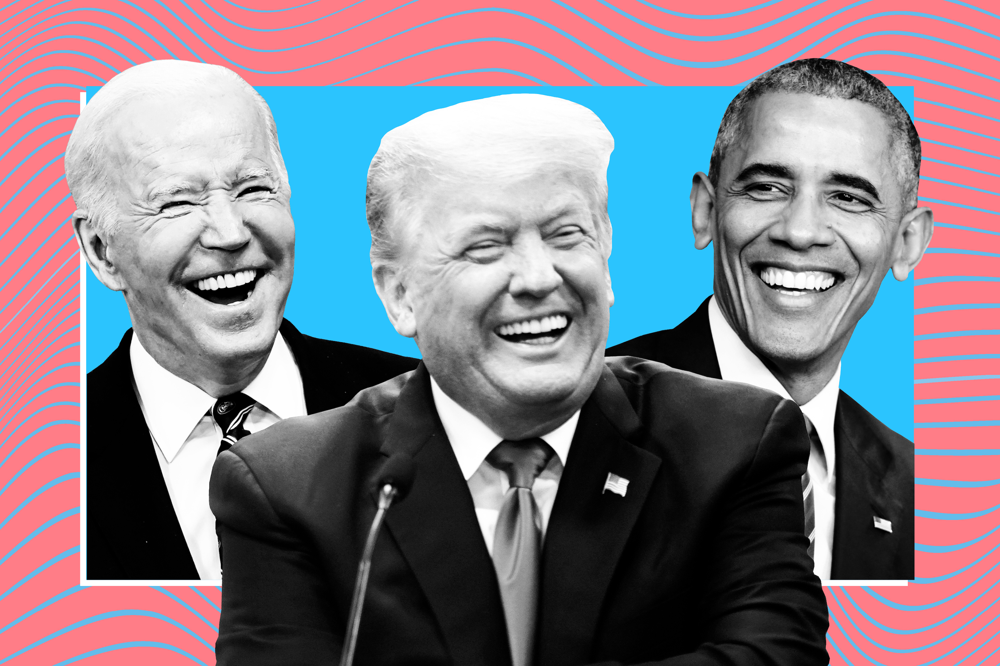

  <!-- You are encouraged to replace this logo with your own! Otherwise you can also remove it. -->
  
   

<!-- TABLE OF CONTENTS -->

# 📗 Table of Contents

- [🔎 Goal](#goal)
- [💻 Usage](#usage)
- [📖 Dataset](#dataset)
- [👥 Authors](#authors)

## 🔎 Goal: 

As part of a Natural Language Processing school project, we have chosen to work on the speeches and writings of American presidents. We aim to accomplish two distinct tasks. The first involves identifying which president wrote a given text, meaning text classification. The second task is to generate a text that mimics the style of a U.S. president.

## 💻 Usage: 

Take a look at the "NLP_presidents.pdf" and the notebooks.\
After running the script "init.sh", you can re-run our notebooks.

## 📖 Dataset: 

Our dataset, called 'corpus' was created from several existing datasets (e.g., Donald Trump's tweets) and we collected additional data through scraping (on https://www.presidency.ucsb.edu). Then, we reformatted this data to combine it into a coherent set. This is stored as multiple files in CSV format.

## 👥 Authors: 
    - Dorian Penso
    - Léa Margery
    - Maxime Buisson
    - Sacha Hibon